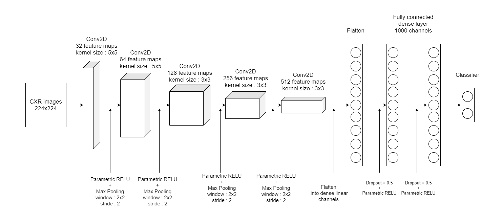

### An Improved Classification of Chest X-ray Images Using Adaptive Activation Function.


*This work was collaborative effort of Tribikram Dhar, Dept. of EE, Gourab Adhikari, Dept. of ETCE and Prof. Sheli Sinha Chaudhuri, Dept. of ETCE, Jadavpur University.*

*The paper was presented at the IEMENTech 2021, IEEE Kolkata Section and is published in the IEEE Xplore,[link](https://ieeexplore.ieee.org/document/9614719)*


Following were the objectives of this research : 

* To explore the possibilties of optimising chest X ray classification using Convolutional Neural Networks (CNN).
* Reduction of number of parameters of the CNN.
* Effective use of parametric activation functions.

*The CNNs were coded using [Pytorch](https://pytorch.org/) and were trained on NVIDIA's [GeForce GTX](https://www.nvidia.com/en-in/geforce/graphics-cards/16-series/) series.*

Other techstack used :
* Pandas
* Matplotlib
* Numpy
* Sklearn





#### Citation


If you find it useful please cite us : 
```
@INPROCEEDINGS{9614719,  author={Dhar, Tribikram and Adhikari, Gourab and Chaudhuri, Sheli Sinha},  booktitle={2021 5th International Conference on Electronics, Materials Engineering & Nano-Technology (IEMENTech)},   title={An Improved Classification of Chest X-ray Images Using Adaptive Activation Function},   year={2021},  volume={},  number={},  pages={1-6},  doi={10.1109/IEMENTech53263.2021.9614719}}
```
