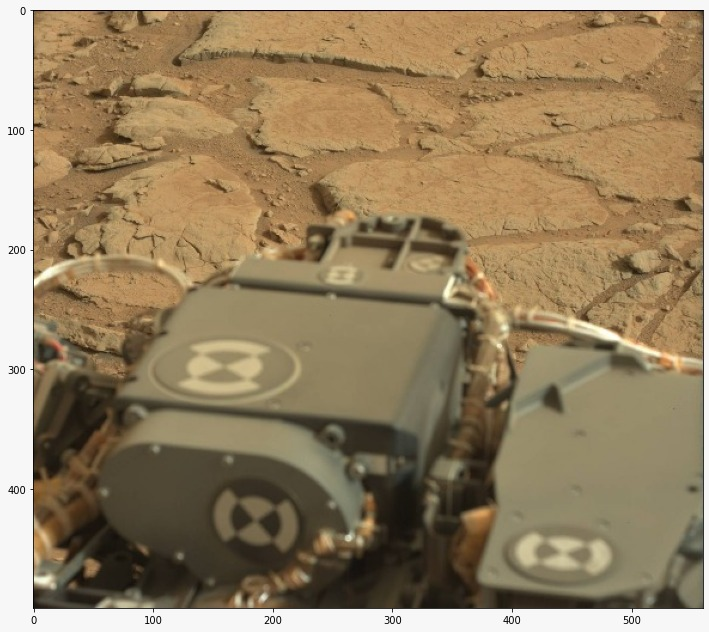
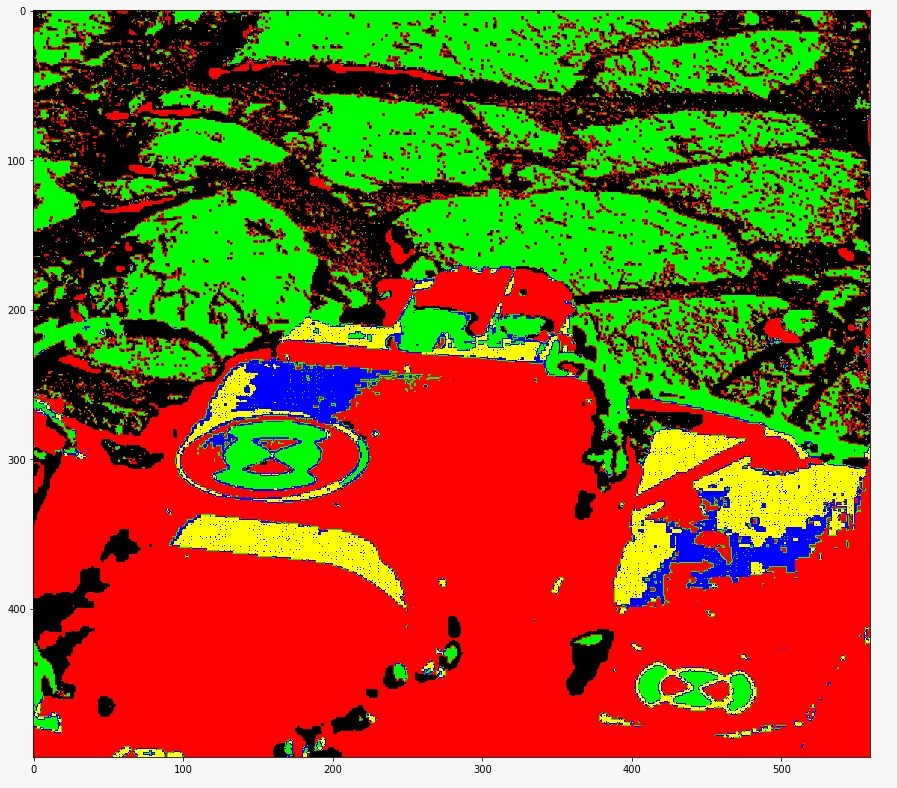

## Unsupervised Image Segmentation for N channelled images.

*This project was made by Tribikram Dhar, Dept of Electrical Engg, Jadavpur University.*

This paper was a direct implentation from the paper [Color image segmentation using a spatial k-means clustering algorithm](https://doras.dcu.ie/4646/)

* The algorithm takes an input (N x C x H) and generates an single channelled segmented mask of the image in O(NHC) time.
* The distance function is customizable, so are the number of epochs for training, error threshold.
* This algorithm enables the user to segment images of 8,16,32 bit and so on.

#### Original Image

| Number of epochs |                                 Segmented Image                                                |
|  --------------  |  --------------------------------------------------------------------------------------------  |
| Untrained (Epochs = 0) |                                                                          |
| Epochs = 10      |                                                                     |
| Epochs = 15      |                                                                     |
| Epochs = 25      |                                                                     |

#### other sample of a [Mars Rover Image](https://www.kaggle.com/datasets/brsdincer/mars-surface-and-curiosity-image-set-nasa)

| Input                                |                 Output                           |
| ------------------------------------ | ------------------------------------------------ |
|              |                          |

To use this project:
- Copy the code from Final.py in your jupyter notebook 
- Follow the comments in the code and call the master function
- Save the file in your directory by providing the path

  
