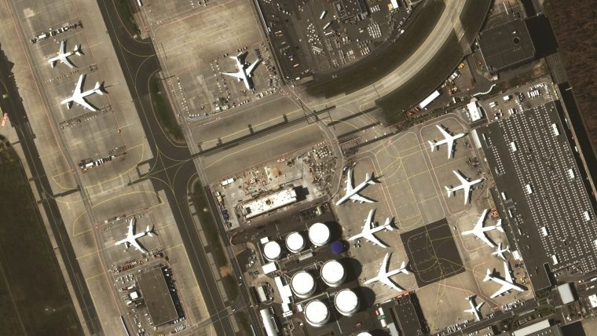
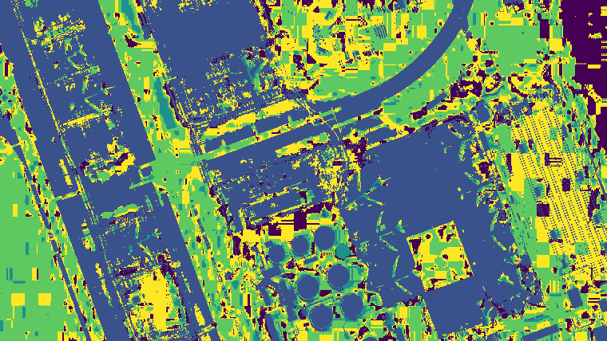
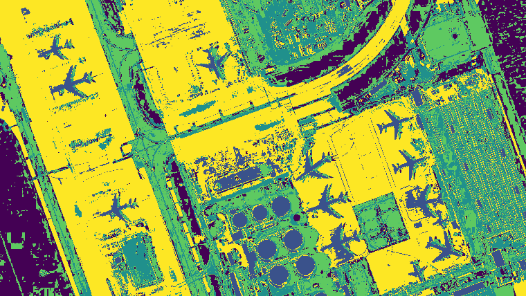
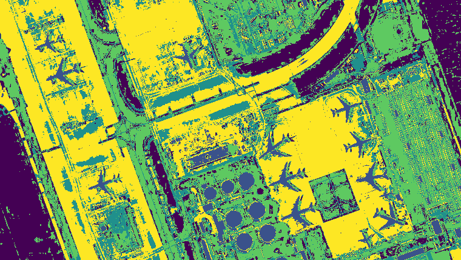
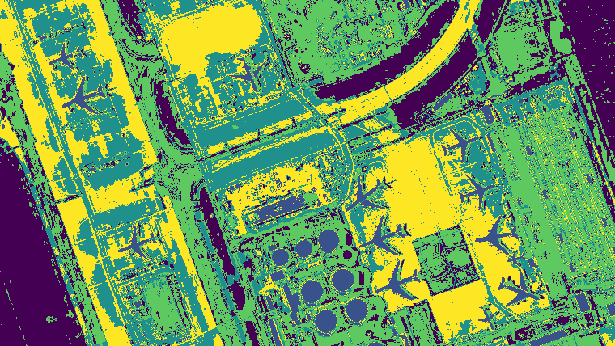

## Unsupervised Image Segmentation for N channelled images.

*This project was made by Tribikram Dhar, Dept of Electrical Engg, Jadavpur University.*

* The algorithm takes an input (N x C x H) and generates an single chanelled segmented mask of the image in O(NHC) time.
* The distance function is customizable, so are the number of epochs, error threshold.

#### Original Image

| Number of epochs |                                 Segmented Image                                                |
|  --------------  |  --------------------------------------------------------------------------------------------  |
| Untrained (Epochs = 0) |                                                                          |
| Epochs = 10      |                                                                     |
| Epochs = 15      |                                                                     |
| Epochs = 25      |                                                                     |

*the documentation is under development*

  
